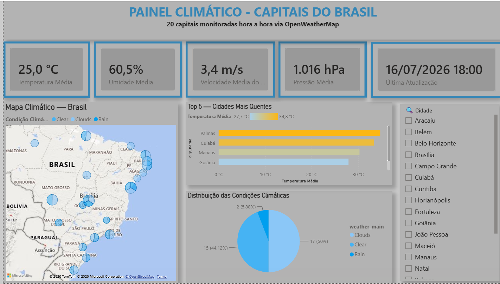

# 🌦️ Weather ETL Pipeline

Pipeline de dados meteorológicos de 20 capitais brasileiras, construído com Apache Airflow, Docker, PostgreSQL e Python, com dashboard em Power BI.

---

## 📌 Sobre o Projeto

Este projeto implementa um pipeline ETL (Extract, Transform, Load) automatizado que coleta dados climáticos em tempo real da API OpenWeatherMap para 20 capitais brasileiras, transforma os dados e os acumula em um banco de dados PostgreSQL — tudo orquestrado pelo Apache Airflow rodando em containers Docker. Os dados históricos alimentam um dashboard em Power BI.

---

## 🏗️ Arquitetura

```
OpenWeatherMap API
        ↓
   [ Extract ]   → Coleta dados meteorológicos de 20 capitais brasileiras
        ↓
   [ Transform ] → Limpeza e transformação dos dados
        ↓
   [ Load ]      → Acumula histórico no PostgreSQL (append)
        ↓
   PostgreSQL Database (weather_data)
        ↓
   Power BI Dashboard
```

---

## 🛠️ Tecnologias Utilizadas

| Tecnologia | Uso |
|---|---|
| **Python** | Linguagem principal |
| **Apache Airflow** | Orquestração do pipeline |
| **Docker / Docker Compose** | Containerização dos serviços |
| **PostgreSQL** | Armazenamento do histórico de dados |
| **OpenWeatherMap API** | Fonte dos dados meteorológicos |
| **Pandas** | Transformação dos dados |
| **SQLAlchemy** | Conexão com o banco de dados |
| **Power BI** | Visualização e dashboard |

---

## 📁 Estrutura do Projeto

```
weather-etl-pipeline/
├── dags/
│   └── weather_dag.py       # DAG principal do Airflow
├── src/
│   ├── extract_data.py      # Extração da API
│   ├── transform_data.py    # Transformação dos dados
│   ├── load_data.py         # Carga (append) no PostgreSQL
│   └── main.py              # Pipeline completo (execução manual/local)
├── docs/
│   ├── powerbi_setup.md      # Guia de configuração do dashboard
│   └── rodando_pipeline.md  # Passo a passo pra rodar o projeto do zero
├── config/
│   └── .env                 # Variáveis de ambiente (não versionado)
├── data/                    # Dados temporários
├── logs/                    # Logs do Airflow
├── main.py                  # Entry point na raiz (python main.py)
├── docker-compose.yml       # Configuração dos containers
└── README.md
```

---

## ⚙️ Como Executar

### Pré-requisitos

- Docker Desktop instalado e rodando
- Conta na [OpenWeatherMap API](https://openweathermap.org/api) (gratuita)

### Passo a Passo

**1. Clone o repositório**
```bash
git clone https://github.com/dudabonini/weather-etl-pipeline.git
cd weather-etl-pipeline
```

**2. Configure as variáveis de ambiente**

Crie um arquivo `.env` na pasta `config/`:
```dotenv
API_KEY=sua_chave_da_api

DB_HOST=localhost
DB_PORT=5434
DB_NAME=weather_db
DB_USER=postgres
DB_PASSWORD=postgres123
```

> `localhost:5434` é para conexões vindas da sua máquina (rodando `python main.py` direto, ou o Power BI Desktop). A porta é 5434 e não 5432 porque a 5432 já está em uso pelo Postgres que você tem instalado localmente. Dentro dos containers do Airflow, `DB_HOST`/`DB_PORT` são sobrescritos automaticamente para `postgres_weather` / `5432` (nome do serviço e porta interna na rede do `docker-compose.yml`) — não precisa mexer em nada pra isso funcionar, já está configurado no compose.

**3. Crie o arquivo `.env` na raiz do projeto**
```bash
echo "AIRFLOW_UID=1000" > .env
```

**4. Suba os containers**
```bash
docker compose up -d
```

**5. Acesse o Airflow**

Abra o navegador em: `http://localhost:8080`
- Usuário: `airflow`
- Senha: `airflow`

**6. Ative e acione o DAG `weather_pipeline`**

---

## 🔄 Pipeline ETL

### Extract
Coleta dados meteorológicos de 20 capitais brasileiras em tempo real via API OpenWeatherMap.

### Transform
Processa e transforma os dados brutos em um formato estruturado usando Pandas.

### Load
Carga **idempotente** na tabela `weather_data` do PostgreSQL: uma constraint `UNIQUE (city_name, datetime)` garante que disparar a mesma leitura mais de uma vez (ex: dois acionamentos manuais próximos) nunca duplica registros — o `INSERT` usa `ON CONFLICT DO NOTHING`. A tabela também evolui de esquema sozinha: campos opcionais que a API só envia às vezes (ex: `rain.1h`, quando está chovendo) são adicionados automaticamente via `ALTER TABLE` no primeiro lote em que aparecem, sem quebrar a carga.

---

## 📊 Agendamento

O pipeline é executado **a cada hora** automaticamente:
```
schedule: '0 * * * *'
```

---

## 📈 Dashboard (Power BI)

O histórico acumulado na tabela `weather_data` alimenta um dashboard em Power BI, conectado diretamente ao PostgreSQL. O passo a passo de conexão, as medidas DAX sugeridas e os visuais recomendados estão em [`docs/powerbi_setup.md`](docs/powerbi_setup.md).

Como o Power BI Desktop (`.pbix`) não é renderizável no GitHub, o dashboard é exportado como imagem e incluído aqui:



---

## 📬 Contato

Feito por **Eduarda Bonini** — [LinkedIn](www.linkedin.com/in/eduardabonini) | [GitHub](https://github.com/dudabonini)
